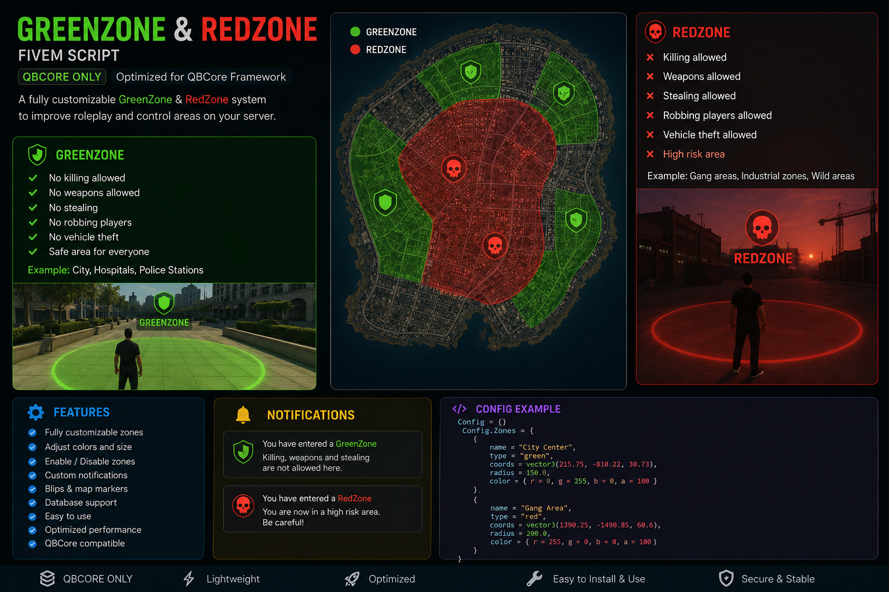

# Sifo GreenZone

Simple Green Zone System for QBCore.



## Features

- Create Green Zones using waypoint
- Save zones in database
- Enable / Disable zones
- Delete zones
- Edit zone radius
- HUD support
- Export support
- Multi-language support
- Weapon restrictions
- Allowed jobs system
- Blocked items system

## Dependencies

- qb-core
- qb-menu
- qb-input
- oxmysql

## Installation

1. Put the script inside your resources folder.

2. Add this to your server.cfg:

```cfg
ensure redzone
```

3. Restart your server.

## Admin Permissions

Add this inside server.cfg:

```cfg
add_ace group.admin greenzone.admin allow
add_ace group.god greenzone.admin allow
```

## How The Script Works

- Administrators can create safe zones using the `/gz` command.
- A waypoint is placed on the map.
- Press `E` to create the zone.
- Players inside the zone cannot use restricted weapons.
- Allowed jobs can still use weapons inside the zone.
- All zones are saved automatically in the database.

## HUD Integration

The script sends this event:

```lua
AddEventHandler('hud:zoneStatus', function(status, zoneName)

    -- status:
    -- green
    -- red

end)
```

## Export

```lua
local inside, zone = exports['redzone']:IsInGreenZone()
```

## Config

### Change Language

```lua
Config.Locale = 'en'
```

### Disable Notifications

```lua
Config.EnableZoneNotify = false
```

### Allowed Jobs

```lua
Config.AllowedJobs = {
    ["police"] = true,
    ["ambulance"] = true
}
```

### Allowed Weapons

```lua
Config.AllowedWeapons = {
    [`WEAPON_STUNGUN`] = true
}
```

