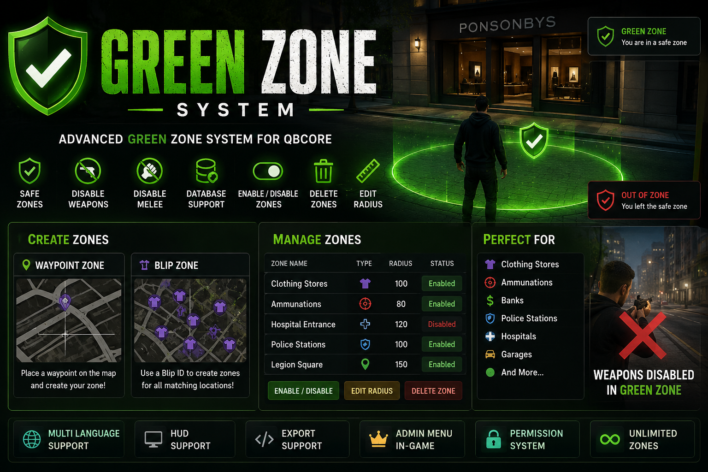

<p align="center">
  
</p>

<h1 align="center">🟢 Green Zone System</h1>

<p align="center">
Advanced Green Zone System for QBCore with support for Waypoint Zones and Blip Zones.
</p>

<p align="center">
    
    
    
    
</p>

---

# ✨ Features

- 📍 Create Green Zones using waypoints.
- 🗺️ Create Green Zones using Blip IDs.
- 🏪 Automatically create zones for all matching locations.
- 🔫 Disable weapons inside Green Zones.
- 👊 Disable melee attacks.
- 💾 Database support.
- 📏 Edit zone radius.
- 🟢 Enable / Disable zones.
- 🗑️ Delete zones.
- 👮 Permission system.
- 🌍 Multi-language support.
- 🖥️ HUD support.
- 🔌 Export support.
- ⚡ Unlimited zones support.
- 🎮 Fully managed in-game using `/gz`.

---

# 🆕 Blip Zone System

The new Blip Zone system allows you to create a single Green Zone entry that automatically applies to all matching locations.

Example:

```text
Name: Clothing Stores
Blip ID: 73
Radius: 100
```

Result:

- Ponsonbys
- Sub Urban
- Binco
- Any other clothing store using the same blip ID

Manage them all from a single menu entry.

---

# 🎮 Usage

Open the menu:

```text
/gz
```

Available options:

```text
Create Waypoint Zone
Create Blip Zone
Manage Zones
```

---

## Create Waypoint Zone

1. Run:

```text
/gz
```

2. Select:

```text
Create Waypoint Zone
```

3. Set:

- Zone name
- Radius

4. Place your waypoint and confirm.

---

## Create Blip Zone

1. Run:

```text
/gz
```

2. Select:

```text
Create Blip Zone
```

3. Enter:

- Zone Name
- Blip ID
- Radius

Example:

```text
Name: Clothing Stores
Blip ID: 73
Radius: 100
```

The system will automatically protect every location using that blip.

---

# 📚 Finding Blip IDs

You can find all available FiveM Blip IDs here:

:contentReference[oaicite:0]{index=0}

Alternative reference:

:contentReference[oaicite:1]{index=1}

These references contain all map icons and their IDs that can be used with Blip Zones. :contentReference[oaicite:2]{index=2}

---

# ⚙️ Dependencies

- qb-core
- qb-menu
- qb-input
- oxmysql

---

# 🚀 Installation

Place the resource inside your resources folder:

```text
resources/[standalone]/greenzone
```

Add to your `server.cfg`:

```cfg
ensure greenzone
```

---

# 🔐 Permissions

Add to your `server.cfg`:

```cfg
add_ace group.admin greenzone.admin allow
add_ace group.god greenzone.admin allow
```

---

# 🗄️ Database Structure

```sql
CREATE TABLE IF NOT EXISTS greenzones (
    id INT AUTO_INCREMENT PRIMARY KEY,
    name VARCHAR(50),
    type VARCHAR(20) DEFAULT 'coords',
    blip_id INT DEFAULT NULL,
    x DOUBLE DEFAULT NULL,
    y DOUBLE DEFAULT NULL,
    z DOUBLE DEFAULT NULL,
    radius INT,
    enabled INT DEFAULT 1
);
```

---

# 📍 Supported Zone Types

| Type | Description |
|------|-------------|
| coords | Traditional waypoint zone |
| blip | Automatically generated zones from matching blips |

---

# 🖥️ HUD Integration

```lua
AddEventHandler('hud:zoneStatus', function(status, zoneName)

    -- status:
    -- green
    -- red

end)
```

---

# 🔌 Export Example

```lua
local inZone, zone = exports['greenzone']:IsInGreenZone()

if inZone then
    print("Player is inside:", zone.name)
end
```

---

# 📷 Preview

Place your promotional image here:

```text
greenzone/
│
├── preview/
│   └── banner.png
│
├── client/
├── server/
├── config.lua
├── fxmanifest.lua
└── README.md
```

The image will automatically appear at the top of the GitHub page.

---

# 🔒 License

This resource is distributed under:

```text
All Rights Reserved
```

You may:

- Use the resource on your server.
- Modify configuration files if allowed.

You may NOT:

- Redistribute the resource.
- Resell the resource.
- Share the source code.
- Claim ownership of the resource.
- Publish modified versions without permission.

---

# ❤️ Support

If you find a bug or have a feature request, open an issue on GitHub.